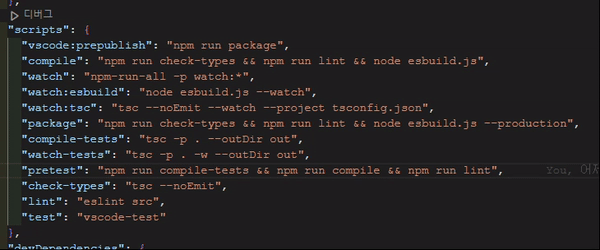

# Package Scripts Hover

VS Code extension that shows helpful descriptions when hovering over package.json scripts.

## Features



- Hover over npm scripts to see descriptions
- Supports custom documentation via `.vscode/script-docs.json` in a nested structure.
- Automatically converts old `.vscode/script-docs.json` format upon loading.
- Documentation cache automatically reloads when `.vscode/script-docs.json` is changed, created, or deleted.
- Built-in documentation for common scripts
- Easy to customize and extend

## Usage

1. Open a package.json file
2. Hover over any script in the scripts section
3. View the description, command, and usage in the hover popup

## Custom Descriptions

Create or update `.vscode/script-docs.json` in your project's workspace root. The structure now supports multiple `package.json` files using their relative paths as keys:

```json
{
  "package.json": {
    "start": "Starts the main application",
    "test": "Runs all tests"
  },
  "packages/frontend/package.json": {
    "dev": "Starts frontend development server",
    "build": "Builds frontend assets"
  },
  "packages/backend/package.json": {
    "start:dev": "Starts backend server in dev mode"
  }
}
```

If you have an existing `.vscode/script-docs.json` with the old flat structure, it will be automatically converted to the new nested structure format the first time the extension loads it.

Use the command `Package Scripts Hover: Create/Update Script Documentation` to automatically generate/update this file based on all package.json files found in your workspace.

## Requirements

VS Code version 1.77.0 or higher

## Extension Settings

This extension contributes the following settings:

- `packageScriptsHover.enabled`: Enable/disable hover descriptions
- `packageScriptsHover.customDocsPath`: Path to custom documentation file (defaults to `.vscode/script-docs.json`)

## Known Issues

Currently none.

Report issues at GitHub Issues

https://github.com/oinochoe/vscode-package-scripts-hover/issues

## Release Notes

### 0.1.0

- Add support for nested package.json structures by scanning all package.json files in the workspace and using a nested structure in `.vscode/script-docs.json`.
- Implement automatic conversion of old `.vscode/script-docs.json` format to the new nested structure upon loading.
- Add automatic documentation cache reload when `.vscode/script-docs.json` is changed, created, or deleted (with debounce).
- Update `createDocs` command to scan all package.json files and merge into the central `.vscode/script-docs.json`.

### 0.0.2 (2024-03-26)

#### Added

- New commands for extension management:
  - `Enable Package Scripts Hover`: Manually enable hover functionality
  - `Disable Package Scripts Hover`: Manually disable hover functionality
  - `Reload Custom Docs`: Force reload documentation cache
  - `Create Script Documentation Template`: Automatically generate script-docs.json template from package.json
- Automatic script documentation template generation:
  - Creates .vscode directory if needed
  - Generates script-docs.json with default descriptions
  - Asks for confirmation before overwriting existing file
  - Opens generated file for immediate editing

### 0.0.1

Initial release of Package Scripts Hover

## License

[MIT](LICENSE)
